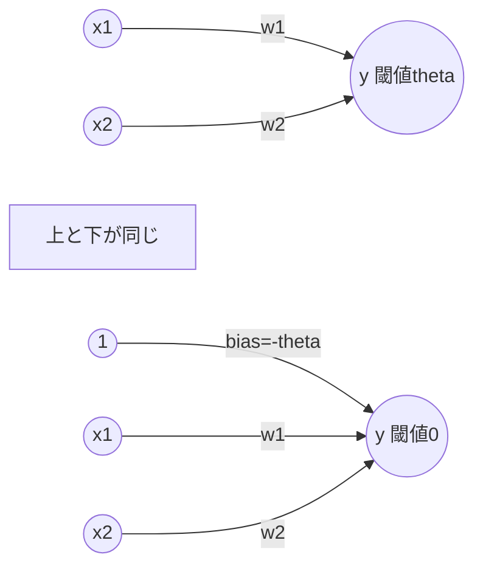

# パーセプトロンからニューラルネットワークへ

- 閾値thetaの負数をbiasと定義したときに以下が言える。

```mermaid
graph LR
  x21((x1)) --w1-->y2((y 閾値theta))
  x22((x2)) --w2-->y2
  text[上と下が同じ]
  bias1((1)) --bias=-theta--> y1((y 閾値0))
  x11((x1)) --w1-->y1
  x12((x2)) --w2-->y1
```